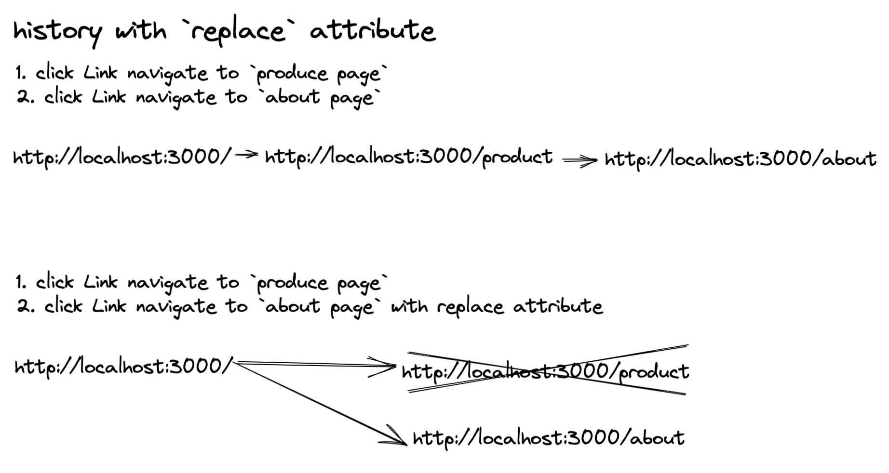

# File Based Routing

## References

- [Reference - Next.js Routing](https://nextjs.org/docs/routing/introduction)
- [Reference - Nested Layout](https://youtu.be/69-mnojSa0M)
- [Reference - Multiple Nested Layout](https://simplernerd.com/nextjs-multiple-layouts/)

## Intro

#### Routing in a React app
- install a third party package
- `routes.js` file to configure the routes
- for each route, create a component file, export the component, import it in `routes.js` and configure the new route with a path property

#### Routeing in a Next.js app
- `file-system` based routing mechanism
- when a file is added to the pages folder in a project, it automatically becomes available as a route
- by mixing and matching file names with a nested folder structure, it is possible to pretty much define the most common routing patterns

## Summary
- [route with pages](#route-with-pages)
- [nested routes](#nested-routes)
- [dynamic routes](#dynamic-routes)
- [nested dynamic routes](#nested-dynamic-routes)
- [get router parameters in page](#get-router-parameters-in-page)
- [catch all routes](#catch-all-routes)
- [navigate from the UI](#navigate-from-the-ui)
- [navigate programmatically](#navigate-programmatically)
- [custom error page](#custom-error-page)
- [nested layout](#nested-layout)

## Route With Pages
[back to summary](#summary)
<table>
<tr>
<th>next pages folder</th>
<th>react router</th>
</tr>
<tr>
<td>

```sh
pages
├── _app.tsx
├── about.tsx   # http://localhost:3000/about
└── index.tsx   # http://localhost:3000/
```

</td>
<td>

```jsx
<Routes>
    <Route to="/" element={<Index />} />
    <Route to="about" element={<About />} />
</Routes>
```

</td>
</tr>
</table>

## Nested Routes
[back to summary](#summary)
<table>
<tr>
<th>next pages folder</th>
<th>next pages folder with index</th>
<th>react router</th>
</tr>
<tr>
<td>

```sh
pages
├── _app.tsx
├── blog
│   └── first.tsx   # http://localhost:3000/blog/first
├── blog.tsx        # http://localhost:3000/blog
└── index.tsx       # http://localhost:3000/
```

</td>
<td>

```sh
pages
├── _app.tsx
├── blog
│   ├── first.tsx   # http://localhost:3000/blog/first
│   └── index.tsx   # http://localhost:3000/blog
└── index.tsx       # http://localhost:3000/
```

</td>
<td>

```jsx
<Routes>
    <Route to="/" element={<Index />} />
    <Route to="blog" element={<Blog />}>
    <Route to="blog/first" element={<First />} />
</Routes>
```

</td>
</tr>
</table>

## Dynamic Routes
[back to summary](#summary)

NOTE: specific page > dynamic routes page

<table>
<tr>
<th>next pages folder</th>
<th>react router</th>
</tr>
<tr>
<td>

```sh
pages
├── _app.tsx
├── product
│   ├── index.tsx       # http://localhost:3000/product/
│   ├── order.tsx       # http://localhost:3000/product/order
│   └── [productId].tsx # http://localhost:3000/product/:productId
└── index.tsx           # http://localhost:3000/
```

</td>
<td>

```jsx
<Routes>
    <Route to="/" element={<Index />} />
    <Route to="product" element={<Product />} />
    <Route to="product/:productId" element={<ProductDetail />} />
    <Route to="product/order" element={<ProductOrder />} />
</Routes>
```

</td>
</tr>
</table>

## Nested Dynamic Routes
[back to summary](#summary)

<table>
<tr>
<th>next pages folder</th>
<th>react router</th>
</tr>
<tr>
<td>

```sh
pages
├── _app.tsx
├── product
│   ├── index.tsx           # http://localhost:3000/product/
│   └── [productId]
│       ├── index.tsx       # http://localhost:3000/product/:productId/
│       └── review
│           └── [reviewId]  # http://localhost:3000/product/:productId/review/:reviewId
└── index.tsx               # http://localhost:3000/
```

</td>
<td>

```jsx
<Routes>
    <Route to="/" element={<Index />} />
    <Route to="product" element={<Product />} />
    <Route to="product/:productId" element={<ProductDetail />} />
    <Route to="product/:productId/review/:reviewId" element={<ReviewDetail />} />
</Routes>
```

</td>
</tr>
</table>

## Get Router Parameters In Page
[back to summary](#summary)

```typescript
// pages/product/:productId/review/:reviewId
import { useRouter } from 'next/router'

const router = useRouter()
const { productId, reviewId } = router.query
```

## Catch All Routes
[back to summary](#summary)

- catch all routes
    - `[...params].tsx` - Dynamic routes can be extended to catch all paths by adding three dots (...) inside the brackets.
    - `pages/doc/[...params].tsx` matches `/doc/a`, `/doc/a/b`, `/doc/a/b/c`, and so on 
- optional catch all routes
    - `[[...params]].tsx`
    - `pages/doc/[[...params]].tsx` matches `/doc`, `/doc/a`, `/doc/a/b`, `/doc/a/b/c`, and so on

<table>
<tr>
<th>next pages folder</th>
<th>react router</th>
</tr>
<tr>
<td>

```sh
pages
├── _app.tsx
├── catch-all-routes
│   └── [...params].tsx         # http://localhost:3000/catch-all-routes/*
├── optional-catch-all-routes
│   └── [[...params]].tsx         # http://localhost:3000/oprional-catch-all-routes/*
└── index.tsx                   # http://localhost:3000/
```

</td>
<td>

```jsx
// Similar
<Routes>
    <Route to="/" element={<Index />} />
    <Route to="catch-all-routes" element={<NoMatch />}>
        <Route to="*" element={<CatchAllRoutes/>} />
    </Route>
    <Route to="optional-catch-all-routes" element={<OptionalCatchAllRoutes/>}>
        <Route to="*" element={<OptionalCatchAllRoutes/>} />
    </Route>
</Routes>
```

</td>
</tr>
</table>

## Navigate From The UI
[back to summary](#summary)

- `<Link>` routing within the application
- use simple `<a>` for client-side routing will trigger a new server request
- Navigate to an external website - `<a>`

#### Basic routing
```typescript
import Link from 'next/link'

const Component = () => {
    return (
        <nav>
            <Link href="/">
                <a>To Home Page</a>
            </Link>
        </nav>
    )
}
```

#### Navigate to dynamic routes
```typescript
import Link from 'next/link'

type PropsType = {
    productId: string
}

const NavigateToProductDetail = ({ productId }: PropsType) => {
    return (
        <Link href=`/product/${productId}`>
            <a>Product { productId }</a>
        </Link>
    )
}
```

#### Replace
```typescript
import Link from 'next/link'

const NavigateReplace = () => {
    return (
        <Link href="to-the-page" replace>
            <a>The Page</a>
        </Link>
    )
}
```



## Navigate Programmatically
[back to summary](#summary)
```typescript
import { useRouter } from "next/router"

const router = useRouter()
const navigateByProgram = () => {
    router.push('/navigate/path')
}
const navigateWithReplace = () => {
    router.replace('/navigate/path')
}
const navigateToPreviousPage = () => {
    router.back()
}
```

## Custom Error Page
[back to summary](#summary)

[Reference - Next.js Custom Error Page](https://nextjs.org/docs/advanced-features/custom-error-page#404-page)

#### 404 page
navigate to a route that is not defined in the pages folder

NOTE: next.js has default 404 page, create `404.tsx` for customize it
```sh
pages
├── _app.tsx
├── 404.tsx     # custom 404 page
└── index.tsx   # http://localhost:3000/
```

## Nested Layout

1. create `Layout` and wrap the `Component` in `_app.tsx`
    ```typescript
    type AppPropsType = {
        Component: NextComponentType<NextPageContext, any, {}> & { Layout: React.ComponentType };
        pageProps: any;
    }

    type LayoutPropsType = {
        children: React.ReactNode;
    }
    
    const EmptyLayout = ({ children }: LayoutPropsType) => <>{ children }</>

    // function MyApp({ Component, pageProps }: AppProps) {
    function MyApp({ Component, pageProps }: AppPropsType) {
        const Layout = Component.Layout || EmptyLayout;
        
        return (
            <>
            <Layout>
                <Component {...pageProps} />
            </Layout>
            </>
        )
    }

    export default MyApp
    ```

2. create `page-layout.tsx` for page component, `children` part will show the page's content
    ```typescript
    function PageLayout({ children }: { children: React.ReactNode }) {
        return (
            <div>
                <h1>Page Layout</h1>
                { children }
            </div>
        );
    }

    export default PageLayout;
    ```

3. use `page-layout.tsx` in the pages component
    ```typescript
    import PageLayout from "path/to/page-layout";

    function PagesComponent({}) {
        return (
            <div>
                Pages Component
            </div>
        );
    }

    PagesComponent.Layout = PageLayout;

    export default PagesComponent;
    ```