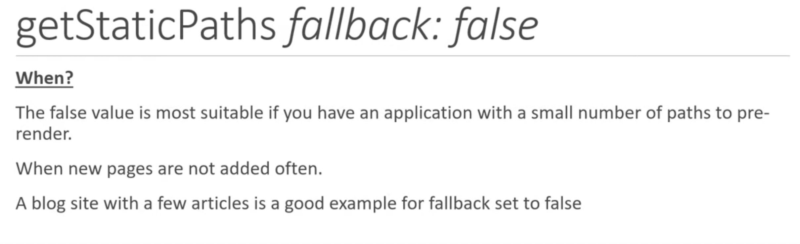
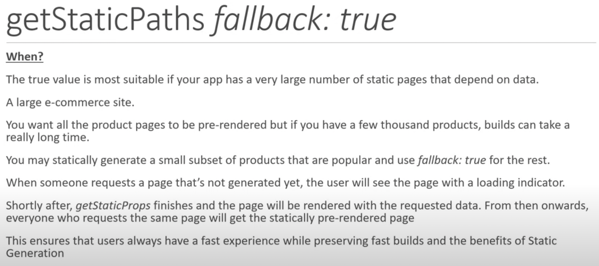
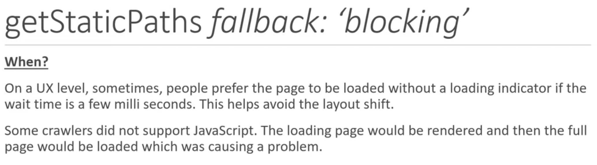
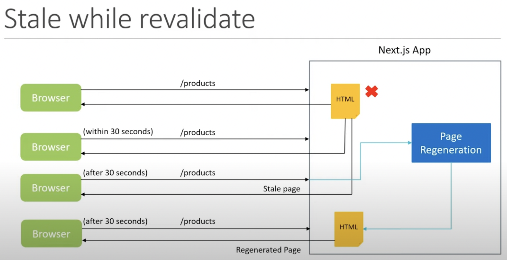

# Static Site Generation(SSG)

Nest.js, by default, without any configuration, statically generates every page in the app when we build it for production.

This allows the page to be cached by a `content delivery network(CDN)` that will serve to the client almost instantly and indexed by a search engine


## Navigation

1. [when to use SSG](#when-to-use-static-site-generation)
1. [how to use SSG](#how-to-use-static-site-generation)
1. [SSG with getStaticProps](#ssg-with-getstaticprops)
1. [introduction of next build](#introduction-of-next-build-information)
1. [SSG with getStaticPath](#ssg-with-getstaticpath)
1. [about fallback in getStaticPath](#about-fallback-in-getstaticpath)
1. [ISR](#incremental-static-regenerationisr)

## When to use static site generation

- blog pages
- e-commerce product pages
- documentation
- marketing pages

## How to use static site generation

Next.js, by default will pre-render every page in the app. The HTML for every page will automatically be statically generated when we build the app

- product server
  - a page will be pre-rendered once whne we run the build command
  - an optimized build is created once and user deploys the build. we don't make code changes on the go once it is deployed
- development server
  - the page is pre-rendered for every request we make
  - we should be able to make changes in our code and we want that code to immediately reflect in the browser

## SSG with `getStaticProps`

- only on the `server-side`
  - the funciton will never run `client-side`
  - the code we write inside `getStaticProps` won't even be included in th JS bundle that is sent to the browser
  - accessing the file system using the `fs` module or querying a database can be done inside `getStaticProps`
  - we don't have to worry about including `API keys` in `getStaticProps` as that won't make it to the browser
  - NOTE - `console.log()` in the `getStaticProps` will show in the terminal
- only in `pages folder`, cannot run from a regular component file
  - only for `pre-rendering` and not `client-side` data fetching
- should return an object, and the object should contain a `props key` which is an object
- `getStaticProps` will run at the build time
  - during development, `getStaticProps` runs on every request

[source code - getStaticProps demo](../pages/pre-rendering/getStaticProps-basic.tsx)

```typescript
export async function getStaticProps() {
  const res = await fetch("https://jsonplaceholder.typicode.com/users");
  const data = await res.json();

  return {
    props: {
      users: data,
    },
  };
}
```

## Introduction of `next build` information

`$ yarn build` - build the app

> run default script: `next build`
>
> it will generate `.next` folder

### the build console looks like this

```sh
$ next build
info  - Checking validity of types
info  - Creating an optimized production build
info  - Compiled successfully
info  - Collecting page data
info  - Generating static pages (12/12)
info  - Finalizing page optimization

# display each route of the app
Page                                                               Size     First Load JS
# type of pre-rendering
#   ○ - static generation, does not fetch any external data
#   ● - SSG(Static Site Generation), page automatically generated as html + json
┌ ○ /                                                              4.99 kB        77.2 kB # root page corresponding to index.js, the first load size is `the size + First load JS shared by all`
├   └ css/149b18973e5508c7.css                                     655 B
├   /_app                                                          0 B            72.2 kB
├ ○ /404                                                           343 B          72.5 kB
├ λ /api/hello                                                     0 B            72.2 kB
├ ○ /file-based-routing                                            575 B          72.7 kB
├ ○ /file-based-routing/catch-all-routes/[...params]               613 B          72.8 kB
├ ○ /file-based-routing/nested                                     528 B          72.7 kB
├ ○ /file-based-routing/nested/[nestedId]                          578 B          72.7 kB
├ ○ /file-based-routing/nested/[nestedId]/deeper/[deeperNestedId]  601 B          72.8 kB
├ ○ /file-based-routing/nested/deeper                              526 B          72.7 kB
├ ○ /file-based-routing/optional-catch-all-routes/[[...params]]    617 B          72.8 kB
├ ○ /pre-rendering                                                 392 B          72.5 kB
└ ● /pre-rendering/getStaticProps-basic (504 ms)                   581 B          72.7 kB
# refer to the code that is downloaded irrespective of the route you're hitting in the browser
+ First Load JS shared by all                                      72.2 kB  # framework code, node modules vendor code
  ├ chunks/framework-91d7f78b5b4003c8.js                           42 kB
  ├ chunks/main-101cfeaa18eb0e64.js                                26.9 kB
  ├ chunks/pages/_app-6c60408482cb0329.js                          2.44 kB  # a component that wraps every page in the app, and the corresponding code is generated as part of the build
  ├ chunks/webpack-69bfa6990bb9e155.js                             769 B    # webpack runtime code
  └ css/10db6fbaeadd0ea0.css                                       218 B    # css from globals.css

λ  (Server)  server-side renders at runtime (uses getInitialProps or getServerSideProps)
○  (Static)  automatically rendered as static HTML (uses no initial props)
●  (SSG)     automatically generated as static HTML + JSON (uses getStaticProps)
```

### .next folder

```sh
# focus on server & static folders
.next
├── server
└── static
# server folder
#   - page folder
#     - .html: static html & SSG
#     - .js: contain code that can NOT be sent to the browser, but they are a transformation of the pages and components written in the app
# static folder
#   - chunk folder
#     - all .js (include children folders, e.g. pages folder): can be sent to the browser
```

---

`$ yarn start` - run the app

> see browser dev tools > Network
>
> the `localhost` in the root route is from `.next/server/index.html`
>
> some resource from `.next/static` doesn't load, because the root page doesn't have `Link` to it

- [reference - stackoverflow: Link prefetching](https://stackoverflow.com/questions/66514628/why-does-prefetching-not-work-for-link-component-in-next-js)
- [reference - next tutorial 20 - 21](https://youtu.be/AWbYJgsXHQ4)

## SSG with `getStaticPath`

when we implement static generation using getStaticProps for a page with dynamic route parameter, we need to tell Next.js that what value Next.js need to consider when it generating the pages at build time, or it will throw the Error: `getStaticPaths is required for dynamic SSG pages and is missing for '/dynamic/route'`

- [reference - implement getStaticProps](https://nextjs.org/docs/basic-features/data-fetching/get-static-props#using-getstaticprops-to-fetch-data-from-a-cms)
- [reference - implement dynamic routing](https://nextjs.org/docs/routing/introduction#dynamic-route-segments)
- [reference - get dynamic routing params in getStaticProps](https://nextjs.org/docs/api-reference/data-fetching/get-static-props#props)
  ```js
  export async function getStaticProps(context) {
    const { params } = context;
    return {
      props: { message: `Next.js is awesome` }, // will be passed to the page component as props
    };
  }
  ```
- [reference - Link with custum child not `<a>` tag](https://nextjs.org/docs/api-reference/next/link#if-the-child-is-a-custom-component-that-wraps-an-a-tag)
- [reference - getStaticPath API](https://nextjs.org/docs/api-reference/data-fetching/get-static-paths)

  ```js
  // example: Next.js will generate 100 post/[postId] pages at build time
  export async function getStaticPaths() {
    const response = await fetch("https://jsonplaceholder.typicode.com/posts");
    const data = await response.json();

    const paths = data.map((post) => {
      return {
        params: {
          postId: `${post.id}`,
        },
      };
    });
    return {
      paths,
      fallback: false,
      // fallback: true, false or "blocking" // See the "fallback" section below
    };
  }
  // reduce build time -> change fallback value to `true` or `blocking`, and don't have to generate all paths in getStaticPaths return value
  /* e.g.
    return {
      paths: [
        { params: {postId: '1'}}
      ],
      fallback: true
    }
  */
  ```

- dynamic parameters with `getStaticPath`
  [reference - next tutorial 22 - 25](https://youtu.be/1XEe-ng57GA)

## about `fallback` in `getStaticPath`

`fallback: true, false or "blocking"`

- [reference - fallback false](https://nextjs.org/docs/api-reference/data-fetching/get-static-paths#fallback-false)
  - 
- [reference - fallback true](https://nextjs.org/docs/api-reference/data-fetching/get-static-paths#fallback-true)

  - [reference - id not found](https://nextjs.org/docs/api-reference/data-fetching/get-static-props#notfound)
  - NOTE: should check router.isFallback in jsx

    ```jsx
    // post/[postId] page
    import useRouter from "next/router";

    const Post = ({ post }) => {
      const router = useRouter();

      if (router.isFallback) {
        return <h1>Loading...</h1>;
      }
      return <PostDetailPage />;
    };

    ...

    export async getStaticProps(context) {
      const response = await fetch("https://jsonplaceholder.typicode.com/posts");
      const data = await response.json();

      // handle illegal id -> show 404 page
      if (!data.id) {
        return {
          notFound: true
        }
      }

      return {
        props: {
          post: data
        }
      }
    }
    ```

  - 

- [reference - fallback blocking](https://nextjs.org/docs/api-reference/data-fetching/get-static-paths#fallback-blocking)
  - 
- [reference - next tutorial 26 - 28](https://youtu.be/ssVYQLGUHiI)

`fallback: true` -> set condition for `notFound: true` in `getStaticProps`

## Incremental Static Regeneration(ISR)

### Static Generation Issues

- build time
  - a page takes 100ms to build -> e-commerce app with 100,000 paroducts takes > 2.5 hours to build
- stale data
  - a page, once generated, can contain stale data till the time you rebuild the application

> There was a need to update only those pages which needed a change without having to rebuild the entire app
>
> with ISR, Next.js allows you to update the static pages after you've built the app
>
> HOW? -> in the `getStaticProps`, aprt from the props key, we can specify a `revalidate` key

[reference - getStaticProps revalidate](https://nextjs.org/docs/api-reference/data-fetching/get-static-props#revalidate)

### concept of revalidate re-generation

`demo - revalidate: 30`


- a re-generation is initiated only if a user makes a request after the `revalidate` time
- `revalidate: 30` does not mean that page automatically re-generates every 30 seconds
- if the background regeneration fails for some reason, the old remains unaltered and the server will continue to serve it

---

in some situatioin, we can NOT afford to serve stale data even for a second -> `SSR`
