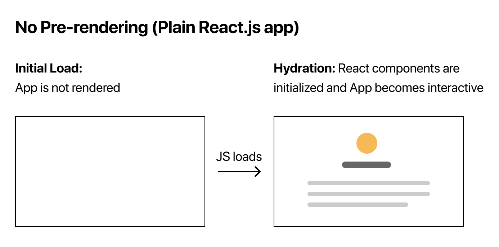

# Pre-rendering

## what does pre-rendering mean?

Next generates HTML for each page in advance instead of having it all done by client-side javascript

pre-rendering is dont by default in a Next app

| Plain React.js app                                                                                                                     | Next.js                                                                                                                                           |
| -------------------------------------------------------------------------------------------------------------------------------------- | ------------------------------------------------------------------------------------------------------------------------------------------------- |
| 1. initial load - app is not rendered 2. JS loads 3. hydration - react components are initialized and app become interactive | 1. initial load - pre-redered HTML is displayed 2. JS loads 3. hydration - react components are initialized and app becomes interactive |
|                                                                     |                                                                                           |

## Why pre-render?

- pre-rendering improves performance
  - in a react app, you need to wait for the javascript to be executed
  - perhaps fetch data from an external API and then render the UI
  - there's a wait time for the user
  - with a pre-renderd page, the HTML is already generated and loads faster
- pre-rendering helps with SEO
  - if we're building a blog or an e-commerce site, SEO is concern
  - with a react app, if the search engine hits the page, it only sees a div tag with id equal to root
  - if search engine hits a pre-rendered page, all the content is present in the source code witch will help index that page

# Pre-rendering Topic

- [Static Site Generation - SSG](#static-site-generation)
  - without data - default, no need to do anything
  - with data - getStaticProps
  - incremental static generation
  - dynamic parameters when fetching data
- [Server-side Rendering - SSR](#server-side-rendering)
  - data fetching
- Client-side data fetching
- Combining pre-rendering with client-side data fetching

## Static Site Generation(SSG)

[readme - SSG](./pre-rendering-SSG.md)

## Server-side Rendering
